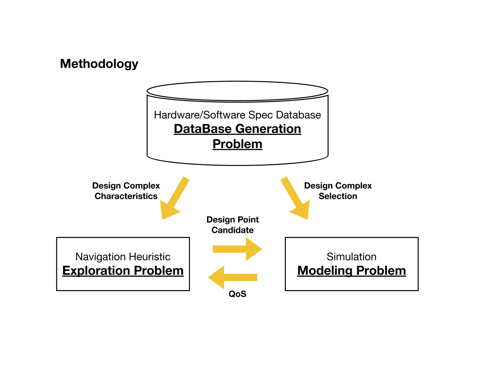
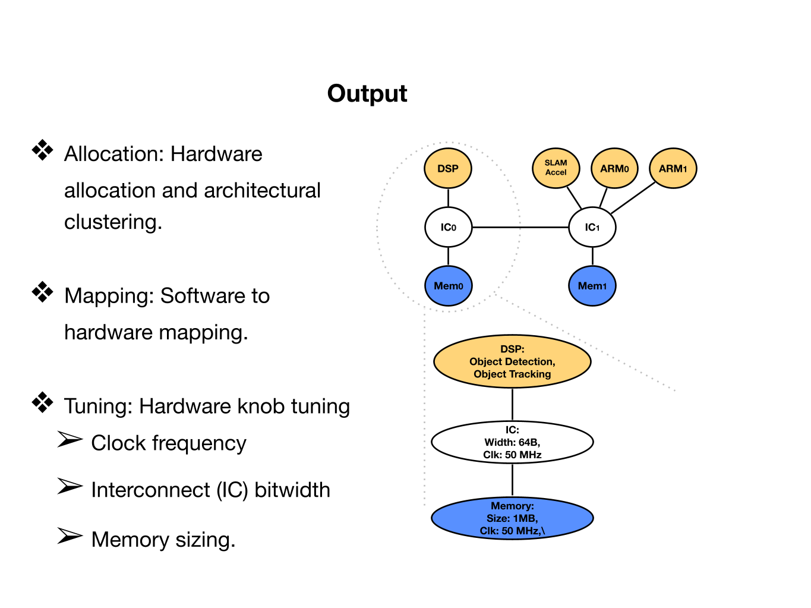
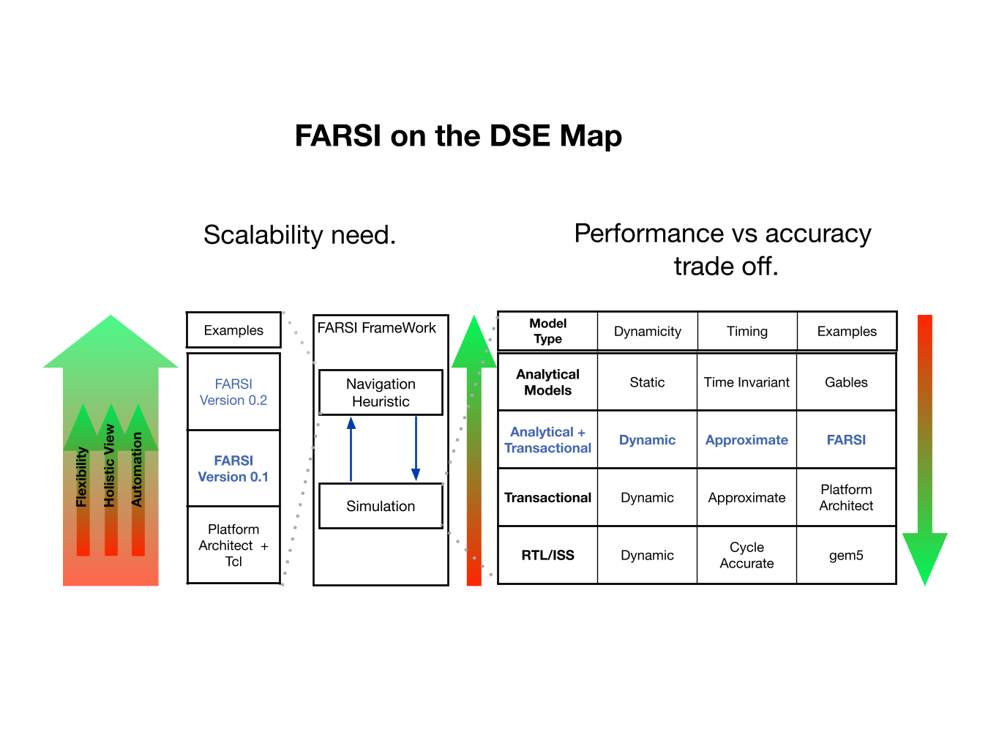

# Project_FARSI
FARSI is a pre-rtl design space exploration framework. It allows SOC designers to find optimal
designs given a set of constraints (performance/power/area and development cost).


## How Does it work
To solve the aforementioned problem, FARSI solves 3 problems simultaneously (figure bellow) using
3 main components:
* (1) A simulator to capture the behavior of the SOC.
* (2) An exploration heuristic to navigate the design space in an optimal fashion.
* (3) A database populated by the designer with workloads (e.g., hand tracking, ...), and the
possible hardware options (e.g., general purpose processors, accelerators, memory, etc).

FARSI continuously samples the database to generate a sample design, simulates its fitness and uses its navigation heuristic to get closer to the optimal design.




## Why FARSI
FARSI is developed to overcome the existing DSE problems such as scalability and performance.
To further clarify this, the figure below puts FARSI on the map compared to the other DSEs.



## Building/Installing FARSI
FARSI is a python based source code. Hence, relevant python libraries need to be installed.


## Running FARSI
```shell
cd data_collection/collection_utils/what_ifs/
```
Set the workload name properly in FARSI_what_ifs.py. Select among, audio_decoder, hpvm_cava, and edge_dtection. 

```shell
python FARSI_what_ifs_simple.py   # run FARSI
```

PS: To modify the settings, modify the settings/config.py file. This file contains many knobs that will determine the exploration heuristic and simulation
features. Please refer to the in file documentations for more details

PS: for more advanced studies (e.g., conducting sweep studies and advance plotting) refer to FARSI_what_ifs.py and set the study_type appropriately.

## Main Contributors
Behzad Boroujerdian
Ying Jing


## How to Cite
@misc{boroujerdian2022farsi,
      title={FARSI: Facebook AR System Investigator for Agile Domain-Specific System-on-Chip Exploration}, 
      author={Behzad Boroujerdian and Ying Jing and Amit Kumar and Lavanya Subramanian and Luke Yen and Vincent Lee and Vivek Venkatesan and Amit Jindal and Robert Shearer and Vijay Janapa Reddi},
      year={2022},
      eprint={2201.05232},
      archivePrefix={arXiv},
      primaryClass={cs.AR}
}

## License
Copyright (c) Facebook, Inc. and its affiliates.
This source code is licensed under the MIT license found in the
LICENSE file in the root directory of this source tree.


